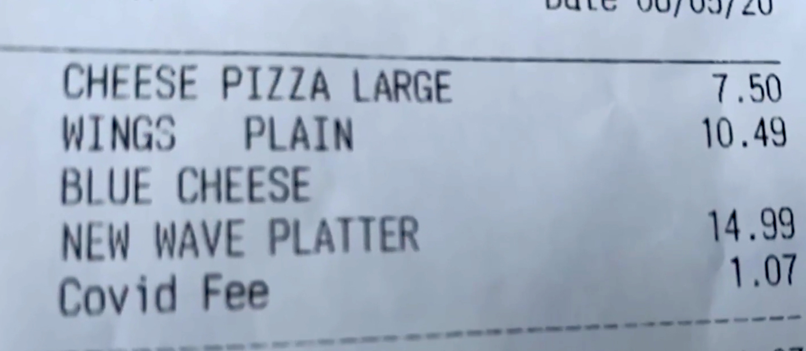
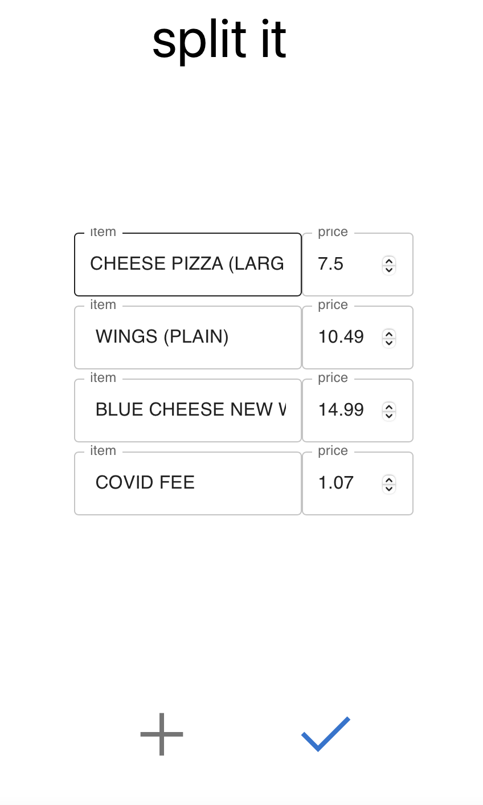

# receipt-parser
State-of-the-art (afaik) performing receipt parser using Optical Character Recognition and ChatGPT.
It takes in a receipt image and outputs a dictionary mapping items to prices. 


## Demo
| Receipt Example | Parsed Result | 
| :---: | :---: |
|  |  |


## setting up
```bash
# create python virtual environment
python3 -m venv env
source env/bin/activate
pip install -r requirements.txt

# set up chatgpt
1. create an account on OpenAI and make sure you can access ChatGPT in the browser
2. following instructions on this repo to inteface with ChatGPT in Python:
https://github.com/mmabrouk/chatgpt-wrapper 
```


## running
```bash
python3 -m parser.main -p ./path/to/receipt_image  # try out the receipts in ./assets
# You can also parse the receipt with a classical method, instead of ChatGPT
python3 -m parser.main -p ./path/to/receipt_image --parse_mode constraints
```
Running ChatGPT can take a while because it is usually busy...


## how it works 
The Python backend uses the OCR model to extract the text from the receipt image, and then uses the ChatGPT model to parse the text into a structured format, extracting information about what food items were purchased and how much they cost. 


## Acknowledgements
This is created during Hack @ Brown 2023, as part of the [Split-it](https://github.com/exing1/split-it) project.

